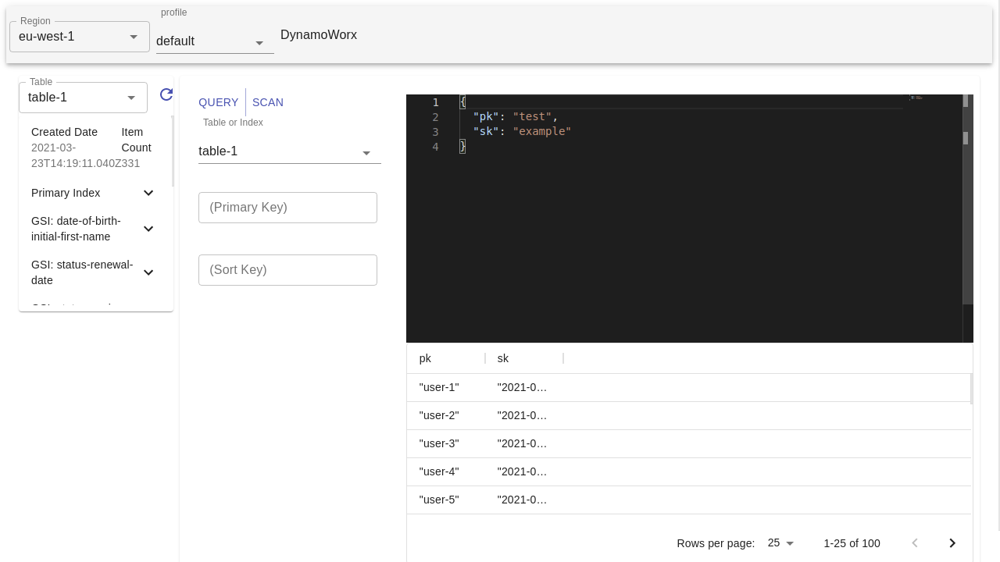

# DynamoDB benchworx

Open source GUI for working with AWS DynamoDB.

- 👍 Built on Electron for cross platform access
- 🚀 Uses the aws-sdk v3 to have a small footprint
- ✔️ Exposes multiple ways to configure aws authentication.



- [DynamoDB benchworx](#dynamodb-benchworx)
  - [Features](#features)
  - [Configuration](#configuration)
    - [Standard Profile](#standard-profile)
    - [MFA Profile](#mfa-profile)
    - [Assume Role in another Account](#assume-role-in-another-account)
    - [Assume Role with MFA](#assume-role-with-mfa)
    - [Single Sign On](#single-sign-on)
    - [Local](#local)

## Features

- [x] Authenticate using AWS `~/.aws/credentials`
- [x] Show dynamoDB records as JSON using monaco editor
- [x] Edit dynamoDB records as JSON using monaco editor
- [x] Query and Scan on Primary, Local Secondary, and Global Secondary indexes
- [ ] Use the aws-sdk for dynamo to design and test queries inside an authenticated REPL

## Configuration

Configuration is supported via the AWS credentials and config files.

By default all available profiles are show in the profile selection.

Here are some examples:

### Standard Profile

```ini
~/.aws/credentials
[profile-name]
aws_access_key_id = id
aws_secret_access_key = secret
```

### MFA Profile

```ini
~/.aws/credentials
[profile-name]
aws_access_key_id = id
aws_secret_access_key = secret
```

```ini
~/.aws/config
[profile mfa-profile]
mfa_serial = arn:aws:iam::<aws_account_arn>:mfa/<username>
source_profile = profile-name
```

### Assume Role in another Account

```ini
~/.aws/credentials
[profile-name]
aws_access_key_id = id
aws_secret_access_key = secret
```

```ini
~/.aws/config
[profile assumed-role]
role_arn = arn:aws:iam::<aws_target_account_arn>:role/<RoleName>
source_profile = profile-name
```

### Assume Role with MFA

```ini
~/.aws/credentials
[profile-name]
aws_access_key_id = id
aws_secret_access_key = secret
```

```ini
~/.aws/config
[profile mfa-assumed-role]
mfa_serial = arn:aws:iam::<aws_account_arn>:mfa/<username>
role_arn = arn:aws:iam::<aws_target_account_arn>:role/<RoleName>
source_profile = profile-name
```

### Single Sign On

Single sign-on is not yet redirecting to the sign on page; so to begin the journey, you need to use aws cli to single sign on.

```bash
aws sso login --profile sso-admin
```

```ini
~/.aws/config
[profile sso-admin]
sso_start_url = https://sso.awsapps.com/start
sso_region = eu-west-1
sso_account_id = 1123456789
sso_role_name = AWSAdministratorAccess
region = us-east-1
output = json
```

### Local

Setup a local dynamoDB agent on a specified port.

```ini
~/.aws/config
[profile local]
region = local
output = json
endpoint=http://localhost:8000
```

