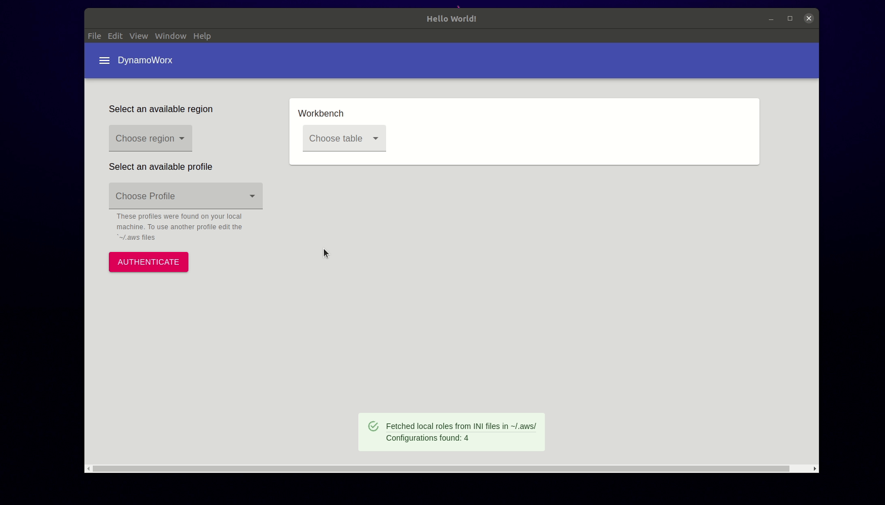

# dynamoDB benchworx

Building an open source dynamoDB CRUD application:

- [ ] Built on Electron for cross platform access
- [ ] Uses the aws-sdk v3 to have a small footprint
- [ ] Exposes multiple ways to configure aws

## Example

