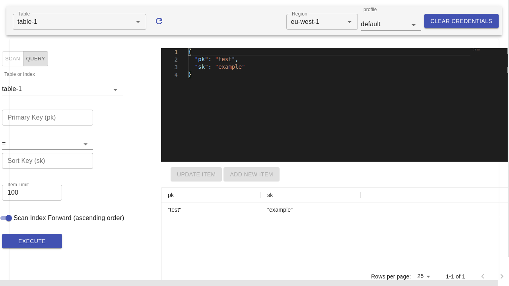

# DynamoDB benchworx

Open source GUI for working with AWS DynamoDB.

- 👍 Built on Electron for cross platform access
- 🚀 Uses the aws-sdk v3 to have a small footprint
- ✔️ Exposes multiple ways to configure aws



- [DynamoDB benchworx](#dynamodb-benchworx)
  - [Features](#features)
  - [Configuration](#configuration)
    - [Standard Profile](#standard-profile)
    - [MFA Profile](#mfa-profile)
    - [Assume Role in another Account](#assume-role-in-another-account)
    - [Assume Role with MFA](#assume-role-with-mfa)
    - [Local](#local)
  - [Contributing](#contributing)
    - [Local Run](#local-run)
    - [Tests](#tests)
    - [End to End testing](#end-to-end-testing)
  - [Releasing](#releasing)

## Features

- [x] Authenticate using AWS `~/.aws/credentials`
- [x] Show dynamoDB records as JSON using monaco editor
- [ ] Edit dynamoDB records as JSON using monaco editor
- [ ] Query and Scan on Primary, Local Secondary, and Global Secondary indexes
- [ ] Use the aws-sdk for dynamo to design and test queries inside an authenticated REPL

## Configuration

Configuration is supported via the AWS credentials and config files.

By default all available profiles are show in the profile selection.

Here are some examples:

### Standard Profile

```
~/.aws/credentials
[profile-name]
aws_access_key_id = id
aws_secret_access_key = secret
```

### MFA Profile

```
~/.aws/credentials
[profile-name]
aws_access_key_id = id
aws_secret_access_key = secret
```

```
~/.aws/config
[profile mfa-profile]
mfa_serial = arn:aws:iam::<aws_account_arn>:mfa/<username>
source_profile = profile-name
```

### Assume Role in another Account

```
~/.aws/credentials
[profile-name]
aws_access_key_id = id
aws_secret_access_key = secret
```

```
~/.aws/config
[profile assumed-role]
role_arn = arn:aws:iam::<aws_target_account_arn>:role/<RoleName>
source_profile = profile-name
```

### Assume Role with MFA

```
~/.aws/credentials
[profile-name]
aws_access_key_id = id
aws_secret_access_key = secret
```

```
~/.aws/config
[profile mfa-assumed-role]
mfa_serial = arn:aws:iam::<aws_account_arn>:mfa/<username>
role_arn = arn:aws:iam::<aws_target_account_arn>:role/<RoleName>
source_profile = profile-name
```

### Local

Setup a local dynamoDB agent on a specified port.

```
~/.aws/config
[profile local]
region = local
output = json
endpoint=http://localhost:8000
```

## Contributing

### Local Run

Running the project locally by pull/forking:

```
yarn install

yarn start
```

### Tests

jest is the test runner used for unit testing:

```
yarn test

```

### End to End testing

Cypress is used for end to end testing using component mounting:

```
yarn cy
```

To update failing snapshots run:

```
yarn cy:u
```

## Releasing

Currently the release process is automated to produce drafts as Beta releases until a stable version is ready.

The release process is.

1. Create a release branch
2. Run the release command
   1. `yarn pub:beta`
   2. Answer yes to all
3. Github Actions will kick off following the creation of the tag, and binaries for the supported operating systems will be produced.
